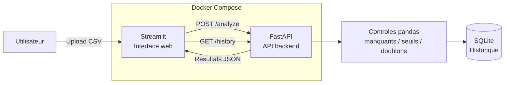

# Suivi de la qualité des données

Application légère permettant d'importer un fichier CSV, d'exécuter des contrôles automatiques de qualité des données, et de visualiser les anomalies détectées.

## Fonctionnalités

- Import d'un fichier CSV avec aperçu immédiat
- Détection des valeurs manquantes
- Détection des valeurs hors seuil, avec **colonne et seuils choisis par l'utilisateur**
- Détection des doublons, avec **colonnes à ignorer paramétrables** (ex: id)
- Historique des analyses sauvegardé dans SQLite
- Interface web interactive (Streamlit)
- API REST (FastAPI)

## Architecture



**Flux** :
1. L'utilisateur importe un CSV via l'interface Streamlit
2. Streamlit envoie le fichier à l'API FastAPI (`/analyze`)
3. FastAPI exécute les 3 contrôles de qualité avec pandas
4. Le résultat est sauvegardé dans SQLite et renvoyé à Streamlit pour affichage
5. L'historique complet est consultable via `/history`

## Prérequis

- Python 3.12+
- Docker et Docker Compose (pour l'exécution conteneurisée)

## Installation et lancement (avec Docker, recommandé)

```bash
docker compose up --build
```

- Interface Streamlit : http://localhost:8501
- API FastAPI (documentation) : http://localhost:8000/docs

## Installation et lancement (sans Docker)

```bash
python -m venv .venv
.venv\Scripts\Activate.ps1        # Windows
source .venv/bin/activate          # Linux / Mac

pip install -r requirements.txt

# Terminal 1 : lancer l'API
uvicorn backend.main:app --reload

# Terminal 2 : lancer l'interface
streamlit run frontend/app.py
```

⚠️ Hors Docker, l'interface Streamlit contacte l'API sur `http://127.0.0.1:8000`. Avec Docker, elle utilise `http://backend:8000` (nom du service). Le code actuel est configuré pour Docker par défaut.

## Lancer les tests

```bash
pytest -q
```

## Fichier de démonstration

Un fichier `data/sample.csv` est fourni avec des anomalies volontaires pour tester l'application :
- Valeurs manquantes (age, salaire)
- Valeur hors seuil (age = 150)
- Doublon (2 lignes identiques hors id)

## Intégration continue

Un workflow GitHub Actions (`.github/workflows/tests.yml`) exécute automatiquement `pytest` à chaque `push` ou `pull request`.

## Limites

Authentification, connexion à des systèmes réels, Kubernetes, cloud complexe, alertes et moteur de règles avancé sont hors périmètre de ce prototype.