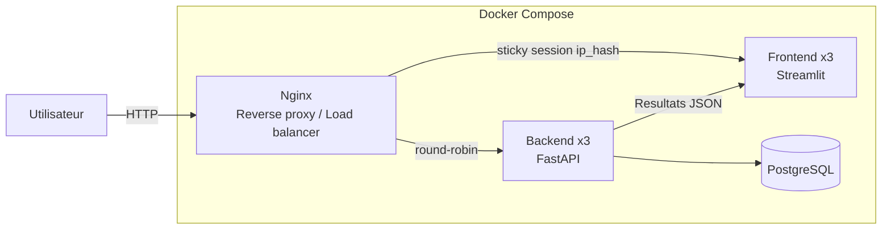

# DataTrack — Suivi de la qualité des données

Application permettant d'importer un fichier CSV, d'exécuter des contrôles automatiques de qualité des données, et de visualiser les anomalies détectées, avec une architecture répliquée et un pipeline CI/CD complet.

## Fonctionnalités

- Import d'un fichier CSV avec aperçu immédiat
- Détection des valeurs manquantes
- Détection des valeurs hors seuil, avec **colonne et seuils choisis par l'utilisateur**
- Détection des doublons, avec **colonnes à ignorer paramétrables** (ex: id)
- Authentification (inscription / connexion)
- Historique des analyses sauvegardé dans PostgreSQL
- Export des rapports au format PDF
- Tableau de bord avec visualisations (score de qualité, répartition des anomalies, évolution dans le temps)
- Interface web interactive (Streamlit)
- API REST (FastAPI)

## Architecture



**Flux** :
1. L'utilisateur accède à l'application via Nginx, point d'entrée unique
2. Nginx répartit les requêtes backend en round-robin entre les 3 instances FastAPI
3. Nginx maintient l'affinité de session sur le frontend (`ip_hash`) entre les 3 instances Streamlit
4. Le backend exécute les contrôles de qualité avec pandas et sauvegarde le résultat dans PostgreSQL
5. L'historique complet est consultable via `/history`

## Réplication et load balancing

| Service | Répliques | Stratégie |
|---|---|---|
| Backend (FastAPI) | 3 | Round-robin (service sans état) |
| Frontend (Streamlit) | 3 | Sticky session `ip_hash` (état de session en mémoire locale) |
| PostgreSQL | 1 | Instance unique (service à état) |

## Prérequis

- Python 3.12+
- Docker et Docker Compose (pour l'exécution conteneurisée)
- Ansible (pour le déploiement automatisé)

## Installation et lancement (avec Docker, recommandé)

```bash
docker compose up --build -d --scale backend=3 --scale frontend=3
```

- Interface Streamlit : http://localhost:8501
- API FastAPI (documentation) : http://localhost:8000/docs
- Visualisation SQLite (db-viewer) : http://localhost:8081

## Installation et lancement (sans Docker)

```bash
python -m venv .venv
.venv\Scripts\Activate.ps1        # Windows
source .venv/bin/activate          # Linux / Mac
pip install -r requirements.txt

# Terminal 1 : lancer l'API
uvicorn backend.main:app --reload

# Terminal 2 : lancer l'interface
streamlit run frontend/app.py
```

## Déploiement automatisé (Ansible)

Un playbook Ansible automatise l'arrêt, le nettoyage, la reconstruction et le redémarrage de l'application avec réplication :

```bash
cd ansible
ansible-playbook -i inventory.ini deploy.yml
```

## Intégration et déploiement continus (CI/CD)

- **CI** (`.github/workflows/tests.yml`) : exécuté à chaque `push` ou `pull request` — tests unitaires (`pytest`), build et vérification de disponibilité des services.
- **CD** (`.github/workflows/deploy.yml`) : déclenché automatiquement si le CI réussit, exécuté sur un runner self-hosted, qui lance le déploiement Ansible.

Le déploiement en production sur **Railway** bénéficie par ailleurs d'un auto-déploiement natif sur push.

## Lancer les tests

```bash
pytest -q
```

## Fichier de démonstration

Un fichier `data/sample.csv` est fourni avec des anomalies volontaires pour tester l'application :
- Valeurs manquantes
- Valeur hors seuil
- Doublon

## Perspectives

Une migration vers Kubernetes (ReplicaSets natifs, auto-réparation des pods) est envisagée comme évolution future, actuellement démontrée de façon fonctionnellement équivalente via Docker Compose et Nginx.
